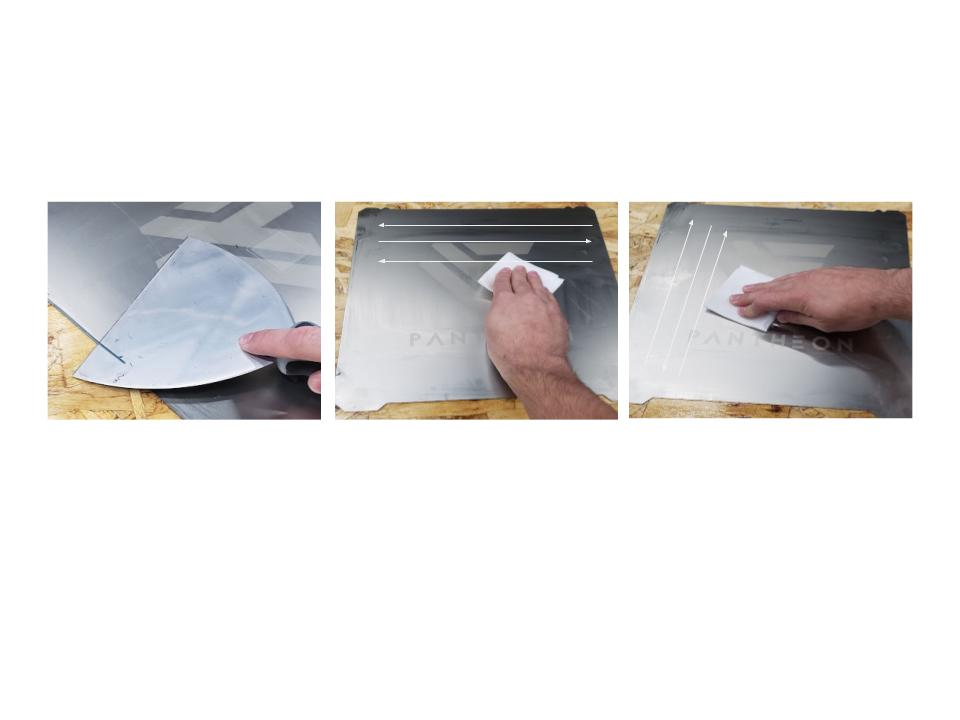

# Machine Operation
{: .no_toc }

This section describes the best workflow to follow when operating the HS3.
{: .fs-6 .fw-300 }

## Table of contents
{: .no_toc .text-delta }

1. TOC
{:toc}

## Workflow

### 1. Preparing the Print File
Using your preferred 3D CAD software, generate an STL file of the part to be uploaded into PrusaSlicer. Make sure your units are in mm when using the 3D CAD software otherwise it may be imported into PrusaSlicer at a 1(in)/25.4(mm) scale.

### 2. Slicing the Part and Generating the G-code File
Open PrusaSlicer and import the STL file. Select the type material and the print setting you want for the part. Click “Slice now” to generate the G-code. Once generated you can look at each layer using the slider on the side of the visual pane to better see how HS3 will print the part. Click “Export G-Code” to save the g-code. 

### 3. Loading the File onto the HS3
To upload the g-code to HS3, go to the Web Console and go to the Jobs tab under File Management and click the “Upload G-Code File(s)” button. Navigate to where the g-code file was saved from PrusaSlicer and click open. An upload progress bar will appear as the file is uploaded to HS3. 

### 4. Preparing the Filament
If filament is not already loaded into HS3, you will need to load it prior to printing. Make sure the filament is dry and the rollers in the filament storage container are not jammed from desiccant packets. Feed filament into the filament port on the side of HS3 until it appears at the print head. Load filament into the top of the extruder. 

### 5. Preparing the Print Surface
Remove the print surface from the machine. If some plastic build-up remains on the bed, it can be removed using a sharp spatula. A razor blade may also be used, but care must be taken not to damage the bed surface.

Soak a lint-free wipe in methanol (AKA Methyl hydrate or methyl alcohol). Wiping in one direction only, wipe the entire surface of the bed, then repeat in the other direction with a different part of the cloth. In some cases a ‘shadow’ of the parts will remain in the PEI coating. This is normal and not a cause for concern. Over time they disappear. Removing plastic buildup with solvents is not recommended as it may damage the PEI coating on the bed. Once fully cleaned, apply adhesive/release agent to the entire surface. Return the print surface onto the PCB bed.

### 6. Cleaning the Nozzle
On the Web Console, set the temperature for the extruder to 235℃. Wait until the nozzle temperature reaches 235℃ and carefully wipe the nozzle with dry lint-free wipes to remove any plastic build-up. If the printhead is in a location unsuitable for cleaning, move the bed down to its lower limit, and move the gantry to the middle using the “Machine Movement” commands in the “Dashboard” tab of the Web Console. 

### 7. Starting the Print File
To start the print job, navigate to the “Jobs” tab in the Web Console and click on the job you want to start. A confirmation pop-up will appear, click yes. The machine will now begin heating up in preparation for printing. Once fully heated, HS3 will home the z-axis and perform a bed mesh to ensure the print surface is free from debris and flat. It will then start your print job. Navigate to the “Status” tab on the Web Console to view the current statistic of the print job. 

### 8. Pausing or Canceling the Print File
If it is required to pause a print job, navigate to the “Status” tab in the Web Console and click on “Pause Print” to pause the print. HS3 will stop printing and move away from the part. Once paused, the “Cancel Print” will appear to allow you to cancel the print job. 

### 9. Emergency Stop
If it is required to emergency stop HS3, in the Web Console click the “Emergency Stop” button always visible in the top right corner. This will reset the controller and stop all machine movement. HS3 will then reconnect to the Web Console after a few seconds. After an emergency stop condition, the machine will have to be homed again prior to starting another print job. 

To return to normal operation after an emergency stop situation, remove all obstructions from inside the machine and run the “Return from Emergency Stop” macro. This will home the machine and set it to an idle and ready state. 

### 10. Removing the Printed Part
Once the print job is complete, wait until the print surface is below 40℃ before removing the print surface and part from HS3. To remove the part, flex the print surface in multiple directions and the part should pop off. If the part remains stuck to the print surface, use a scraper to pry the part off.

