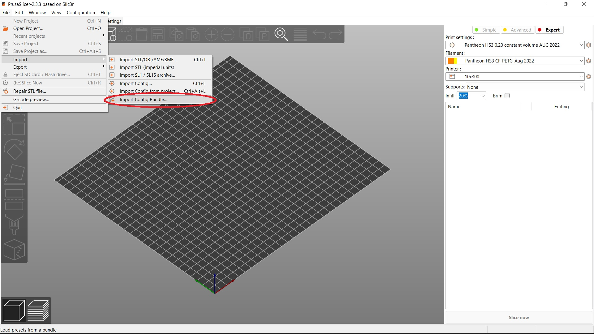

# Slicer
{: .no_toc }

## Table of contents
{: .no_toc .text-delta }

1. TOC
{:toc}

## PrusaSlicer
Pantheon currently uses PrusaSlicer Software from Prusa Research with custom configurations as the primary slicer program for use with the Pantheon HS3. 

The release version used with the Pantheon HS3 is version 2.3.3 which can be downloaded here for your specific operating system:

[PrusaSlicer 2.3.3](https://github.com/prusa3d/PrusaSlicer/releases/tag/version_2.3.3){: .btn .btn-green .fs-5 .mb-4 .mb-md-0 }

## Setup

### Install PrusaSlicer

Install PrusaSlicer with the default settings. On the first launch of the application you may get a pop-up welcoming you to the PrusaSlicer Configuratio Wizard. This is used to set up the slicer program with Prusa printers, however you can click cancel as you will be importing the configuration bundle for the Pantheon HS3.

### Configure PrusaSlicer for Pantheon HS3

Download the Pantheon HS3 config bundle here:

Open PrusaSlicer and navigate to "File" -> "Import" -> "Import Config Bundle..."

 

Import the config bundle you downloaded for the Pantheon HS3.

Once Imported, you will have new options for "Printer," "Filament," and "Print Settings" on the right hand side.