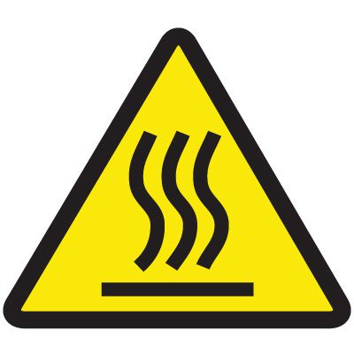
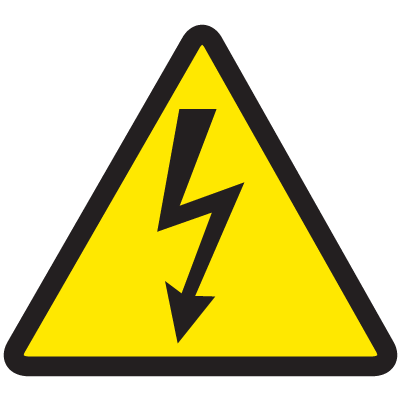

# Safety
{: .no_toc }

This section should be thoroughly read and understood by all operators prior to using the HS3.
{: .fs-6 .fw-300 }

## Table of contents
{: .no_toc .text-delta }

1. TOC
{:toc}

## Safety Verbose

Throughout this guide, important safety considerations are set off from the main text with an associated signal word: “DANGER,” “WARNING,” “CAUTION”. “NOTICE.” The signal word indicates the severity of the condition or situation. Be sure to read these statements and understand the severity of each. Be sure to follow the instructions of these statements. Below is a table describing each signal word.

| Signal Word | Description |
| 
Danger
{: .label .label-red} | Danger means that there is a condition or situation that will cause severe injury or death if the recommended actions are not followed.|
| 
Warning
{: .label .label-yellow} | Warning means that there is a condition or situation that will cause moderate injury if the recommended actions are not followed.|
| 
Caution
{: .label .label-yellow} | Caution means that minor injury or machine damage can occur if the recommended actions are not followed. |
| 
Notice 
{: .label .label-blue}  | Notice means that the text gives additional information or clarification. |

## Warning Labels

The decals listed below are placed on the machine to quickly communicate certain hazards. If the decals become damaged or worn, promptly replace these with the additional supplied decals placed in the maintenance manual.

|  | The component with this icon may reach temperatures that can cause burns if touched. Only interact with the labeled component when it is inactive, when using suitable personal protective equipment, or the temperature has been measured manually. |
|   | A component or location labeled with this icon signifies that a dangerous voltage may exist and to avoid coming into contact with electricity. Only interact with components or areas with this label if the necessary precautions have been taken. |
| LABEL | This label signifies that a team lift is required.  |
| LABEL | A component or location labeled with this icon signifies that an entanglement risk exists. Keep hands, clothes, and other objects clear. Only interact with components or areas with this label if the necessary precautions have been taken. |
| LABEL | A component or location labeled with this icon signifies that a crush risk exists. Keep hands and limbs clear. Only interact with components or areas with this label if the necessary precautions have been taken. |
| LABEL | |

## General Safety Notes
Read all safety warnings, instructions, illustrations and specifications provided in this manual and on HS3. Failure to adhere to all instructions may result in personal injury or damage to the machine. Only authorized or trained personnel may operate this machine. Untrained personnel present a hazard to themselves and the machine.

### HS3 Safety Precautions
- Do not modify any files in the System Directory of the Web Console without specific approval from Pantheon.
- Never reach into, or place any body part within the enclosure while HS3 is performing a print job.
- If multiple people have simultaneous control of HS3, or multiple HS3 units, ensure a suitable work-flow is in place to minimize the risk of the machine becoming active while an individual is in hazardous proximity to the machine.  

### Work Area Safety
- The work area must be adequately illuminated and free from clutter.
- Do not place HS3 in a confined space where heater elements of the system may significantly increase the temperature of the space.
- Do not place HS3 in a position where it may accidentally be exposed to water or other fluids. 

### Electrical Safety
- Keep metallic objects or tools away from electrical connectors and terminations or while the machine is operating otherwise a risk of electrical shock exists. 
- When performing any maintenance tasks involving the electrical system, ensure the machine is powered off unless explicitly stated otherwise.

### Personal Safety
- Always use personal protective equipment when required. 
- Some components of HS3 can reach temperatures that can cause severe burns if handled without care. Thoroughly follow the instructions when dealing with such components.
- Understand that HS3 is computer controlled and may move at unexpected speeds and distances. To prevent crush or entanglement risk, only open the enclosure of the machine when it is in a known and safe state.

### Safety Topics Specific to Additive Manufacturing Systems
- All fused deposition additive machines contain hazards from heat sources and automatically moving components.

